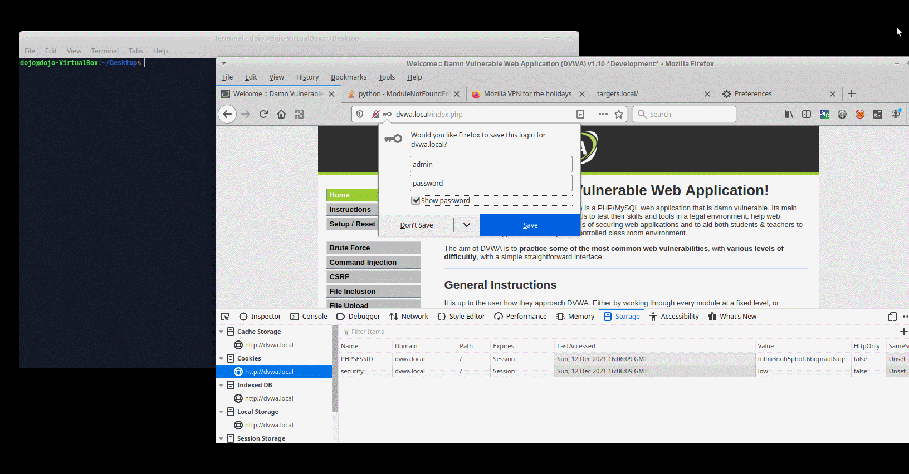

# Разработка безопасного программного обеспечения


```
<?php
```
```diff
! CWE-20 Необходимо проверять так же username и password, например isset(( $_GET[ 'Login' ])) && isset(( $_GET[ 'password' ]))
```
```
if( isset( $_GET[ 'Login' ] ) ) {
	// Get username
```
```diff
! CWE-116 Необходимо экранировать входные данные, например используя функции htmlspecialchars() и stripslashes()
```
```
	$user = $_GET[ 'username' ];
	// Get password
	$pass = $_GET[ 'password' ];
```
```diff
! CWE-327 Необходимо использовать SHA-256 вместо MD5
```
```
	$pass = md5( $pass );
	// Check the database
```
```diff
! CWE-116 Необходимо экранировать входные данные, например используя функции htmlspecialchars() и stripslashes()
! CWE-307 Необходимо ограничить количество запросов, например использовать limit
```
```
	$query  = "SELECT * FROM `users` WHERE user = '$user' AND password = '$pass';";
```
```diff
! CWE-89 Необходимо использовать метод mysqli_real_escape_string()
! CWE-523 Необходимо использовать параметризацию SQL запросов, также использовать функции htmlspecialchars() и stripslashes()
! CWE-306 Необходимо создавать пользователя только с правами на чтение для выборки из базы данных
! CWE-307 Необходимо ограничить количество запросов, например создать двухфакторную аутендификацию или капчу	
```
```
	$result = mysqli_query($GLOBALS["___mysqli_ston"],  $query ) or die( '<pre>' . ((is_object($GLOBALS["___mysqli_ston"])) ? mysqli_error($GLOBALS["___mysqli_ston"]) : (($___mysqli_res = mysqli_connect_error()) ? $___mysqli_res : false)) . '</pre>' );
```
```diff
! CWE-799 Необходимо ограничить многократные запросы для предотвращения DOS-атаки БД, например использовать sleep, а еще лучше sleep(rand(int, int))
```
```
	if( $result && mysqli_num_rows( $result ) == 1 ) {
		// Get users details
		$row    = mysqli_fetch_assoc( $result );
		$avatar = $row["avatar"];
		// Login successful
```
```diff
! CWE-79 Необходимо предовратить межсайтовый скриптинг, например использовать параметризацию, кодирование ввода и проверка
```
```
		$html .= "<p>Welcome to the password protected area {$user}</p>";
		$html .= "";
	}
	else {
		// Login failed
		$html .= "<pre><br />Username and/or password incorrect.</pre>";
	}
	((is_null($___mysqli_res = mysqli_close($GLOBALS["___mysqli_ston"]))) ? false : $___mysqli_res);
}
?>
```


